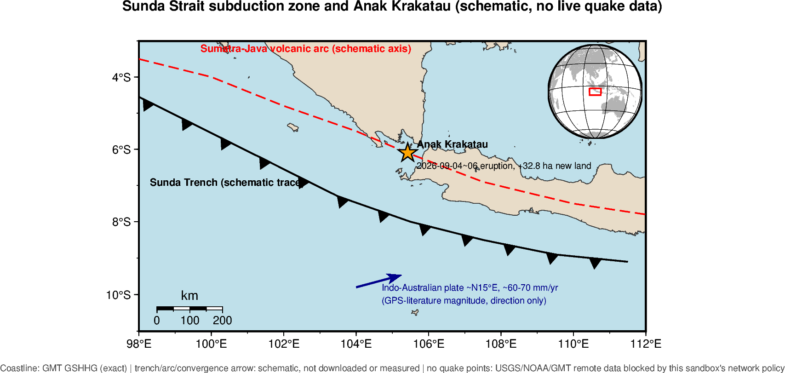

# 案例：2026 巽他海峽・喀拉喀托之子

[回課程首頁](../README.md) · [交界帶整理表](../plate-boundaries.md) · [板塊構造課程](https://github.com/oceanicdayi/2026_utaipei_plate_tectonic)

新聞事件：2026-09-04 至 06，印尼「喀拉喀托之子」（Anak Krakatau）火山活動約 25 小時，熔岩與噴發物堆積使火山陸地面積增加約 32.8 公頃，西北側、東南側各出現一處新地貌（距火山岸線約 760 m、495 m）；印尼能源礦產部地質局已用衛星影像與現場回報證實地貌變化，但尚未認定為新火山島或新火口。新聞來源：[NOWnews〈火山噴發後冒出2座島？印尼巽他海峽新陸地 地質局證實地貌變化〉](https://www.nownews.com/news/6878103)。

這是 [03_ai_exploration.md](../03_ai_exploration.md) 作業格式的一份實作示範：挑一段板塊交界帶，畫圖、切剖面、寫證據，只是這次剖面是由一則正在發生的新聞事件帶出來的。

## 圖



## 圖說（依作業格式：看到什麼、符合哪一類交界、哪裡不確定）

**看到什麼**：海岸線清楚呈現蘇門答臘南端與爪哇西段夾出巽他海峽；示意海溝沿蘇門答臘外海往東南延伸，在爪哇外海轉為大致東西走向；喀拉喀托之子座落在海溝轉折帶的內側、火山弧示意線與海岸線之間，正是這次噴發、增積新陸地的地點。

**符合哪一類交界、圖上哪些是證據**：這是聚合型的隱沒帶——印澳板塊向北隱沒到巽他（歐亞）板塊之下；蘇門答臘段是高度斜向聚合（另有蘇門答臘斷層吸收走向滑移分量），爪哇段接近正交隱沒。火山弧（喀拉喀托之子、以及蘇門答臘、爪哇沿線其他火山）大致平行海溝，是隱沒帶最典型的地表證據；喀拉喀托之子在 2026 年 9 月仍持續噴發、供應岩漿，是這條隱沒帶「現在仍在活動」的直接觀測證據。

**哪裡不符合／不確定、還缺什麼資料**：這張圖**沒有地震點**——本次執行環境（Claude Code 沙盒）的網路政策封鎖了 `earthquake.usgs.gov`、`www.ngdc.noaa.gov` 與 GMT 遠端地形伺服器（連線得到 403），抓不到即時地震目錄、火山目錄或全球地形網格，因此看不到隱沒帶最關鍵的證據——由淺到深、往陸地方向傾斜的地震帶，也量不出走廊內地震深度分布與 A–B 剖面的實際傾角。圖上的海溝、火山弧線只是手繪示意，不是下載或量測的邊界線，實際位置與彎曲細節需要疊上 Bird (2003) PB2002 或 Slab2 之類的資料集才能確認；聚合方向箭頭的速度量級（~N15°E、~60–70 mm/yr）引自公開 GPS 文獻的量級，不是本次計算或量測結果。這張示意圖也沒有畫出蘇門答臘斷層，容易讓人誤以為整段都是純粹正交隱沒，實際上斜向聚合的應力分配比圖上呈現的更複雜。

## 資料註記

| 項目 | 來源與精確度 |
| --- | --- |
| 海岸線 | GMT GSHHG intermediate 解析度，離線內建，精確 |
| 喀拉喀托之子座標 | 105.423°E, 6.102°S，公開文獻座標，非本次下載 |
| 海溝、火山弧走向 | 手繪示意線，依 Bird (2003)／Hall (2002) 一類板塊模型的概念繪製，非下載或量測資料，只用來判斷大致方向 |
| 聚合方向與速度量級 | ~N15°E、~60–70 mm/yr，引自公開 GPS 文獻常見量級，非本次計算 |
| 地震目錄、地形網格 | 未取得——本次沙盒環境的網路政策封鎖 `earthquake.usgs.gov`、`www.ngdc.noaa.gov`、GMT 遠端地形伺服器（403） |
| 新聞事件細節 | 2026-09-04~06 火山活動約 25 小時、陸地 +32.8 公頃、西北側新地貌距岸 760 m、東南側 495 m；來源 [NOWnews 6878103](https://www.nownews.com/news/6878103) |

## 檔案

| 檔案 | 說明 |
| --- | --- |
| [`context_map.py`](context_map.py) | 示意版：只用本機 GMT GSHHG 海岸線＋手繪示意線，不連網、可在任何裝了 pygmt 的環境跑，輸出 `context_map.png` |
| [`dataviz_map_section.py`](dataviz_map_section.py) | 資料驅動版：沿用 [`examples/02_region_map_section.py`](../examples/02_region_map_section.py) 模板，region、A–B 端點改成巽他海峽，並疊上喀拉喀托之子；需要對外連線抓 USGS 地震目錄與 GMT 全球地形，本次沙盒環境跑不動，留給有網路的環境（本機或 Colab）執行 |
| `context_map.png` | `context_map.py` 的輸出 |

## 在有網路的環境接著做

`dataviz_map_section.py` 已經照 [`plate-boundaries.md`](../plate-boundaries.md) 的「蘇門答臘–爪哇」列（範圍 92, 116, -12, 8）縮小到巽他海峽轉折段（`REGION = [100, 110, -10, -2]`），A–B 端點 `(103.5, -8.5) -> (106.5, -5.0)` 大致垂直海溝、通過喀拉喀托之子附近，走廊半寬 150 km。在本機裝好 `pygmt=0.17 gmt=6.5 ghostscript pandas` 或在 Colab 跑 `03_ai_exploration.md` 的環境格之後，直接執行：

```bash
python3 dataviz_map_section.py
```

會輸出 `sunda_strait_map.png`（地形＋地震三段深度＋A–B 線與走廊）與 `sunda_strait_section.png`（距離–深度剖面，深度軸到 700 km），並在終端機印出圖說骨架（USGS 筆數、規模門檻、走廊內多少筆是預設深度）。把這兩張圖換掉本篇的示意圖，圖說的「哪裡不確定」那段就可以改寫成真正看到、量到的東西。
